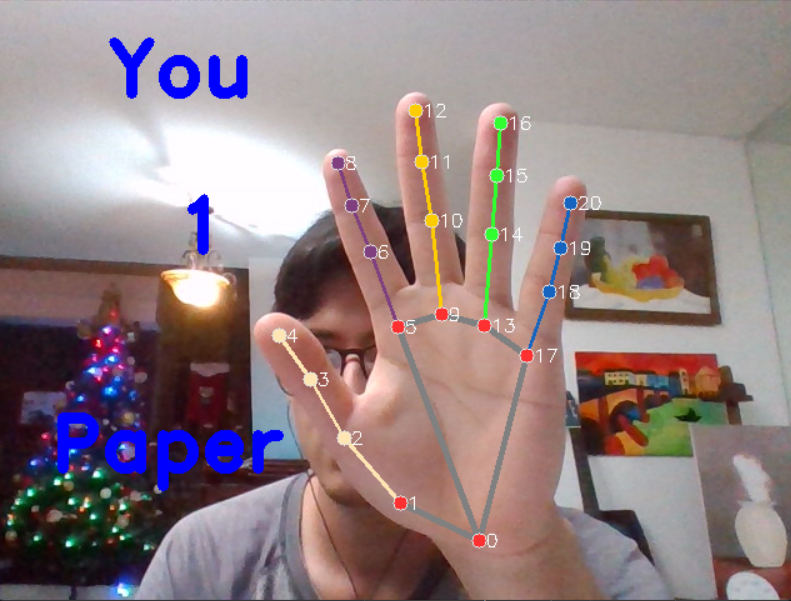
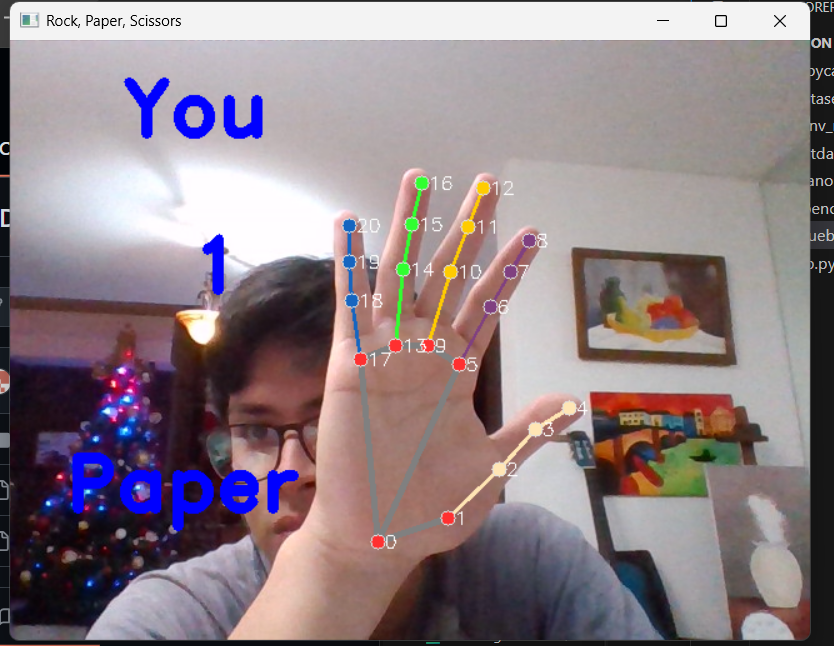

# 📸 Hand Gesture Dataset Creator (Multi-Modal)

Sistema dual para la creación de datasets de gestos de mano (Rock, Paper, Scissors). Permite capturar datos únicamente visuales o sincronizarlos con bioseñales del brazalete MYO Armband.

## 📋 Tabla de Contenidos
- [Descripción de los Scripts](#descripción-de-los-scripts)
- [Requisitos](#requisitos)
- [Estructura del Proyecto](#estructura-del-proyecto)
- [Uso](#uso)
- [Formato de Datos](#formato-de-datos)
- [Landmarks de MediaPipe](#landmarks-de-mediapipe)
- [Solución de Problemas](#solución-de-problemas)

---

## Descripción de los Scripts
El proyecto cuenta con dos herramientas principales según el nivel de datos requerido:

**1. ```getdata_rsp.py``` (Básico):**
- **Enfoque:** Visión artificial pura.
- **Captura:** Imágenes RGB (.jpg) y coordenadas de la mano (.csv).
- **Ideal para:** Modelos de clasificación de imágenes o redes neuronales basadas en puntos clave (landmarks).

**2. ```dataset_creator_myo.py``` (Avanzado - Multimodal):**
- **Enfoque:** Fusión de sensores.
- **Captura:** Imágenes + Landmarks + Datos EMG (electromiografía) + Datos IMU (acelerómetro, giroscopio y orientación).
- **Sincronización:** Utiliza un sistema de hilos para capturar una "ventana" de datos del brazalete alrededor del momento de la foto.
- **Ideal para:** Modelos híbridos que combinan visión con señales musculares y de movimiento.

## Requisitos

#### Software
- Python 3.11.9
- Webcam funcional
- MYO Armband SDK
- Sistema operativo: Windows, macOS, o Linux

**Archivo `requirements.txt`:**
```
mediapipe>=0.10.21
opencv-python==4.11.0.86
numpy==1.23.5
```

---

## Estructura del Proyecto

```
Getdata/
│
├── getdata_rsp.py              # Script solo RGB y landmarks
├── dataset_creator_myo.py      # Script Multimodal (RGB + EMG + IMU)
├── MYO_armband_SDK/            # Carpeta con el SDK oficial de Myo
└── dataset/                    # Generado automáticamente
    ├── images/                 # Imágenes (Rock/Paper/Scissors/None)
    ├── landmarks/              # CSV de puntos clave y archivos JSON de metadata
    ├── emg/                    # CSV con los 8 canales de señales musculares (solo Myo)
    └── imu/                    # CSV con orientación y aceleración (solo Myo)
```

---

## Uso

#### Ejecutar el programa

Para iniciar la captura, elige el script según tu hardware disponible:
```bash
# Opción A: Solo cámara
python getdata_rsp.py 

# Opción B: Cámara + Myo Armband conectado
python dataset_creator_myo.py
```

#### Controles del Teclado

| Tecla | Función |
|-------|---------|
| `1` | Modo ROCK (piedra) |
| `2` | Modo PAPER (papel) |
| `3` | Modo SCISSORS (tijeras) |
| `4` | Modo NONE (sin gesto) |
| `ESPACIO` | Iniciar/Pausar captura automática |
| `S` | Capturar imagen individual |
| `D` | **ELIMINAR TODO** el dataset |
| `Q` | Salir del programa de forma segura|

---

## Formato de Datos

#### Imágenes y Landmarks (Ambos scripts)
- **Imágenes:** JPG 640x480 sin marcas de dibujo para entrenamiento limpio.
- **Landmarks:** Archivos CSV con 21 puntos (x, y, z) mapeados por MediaPipe.

#### Datos de Sensores (Solo dataset_creator_myo.py)
- **EMG:** Archivo CSV por muestra con los valores de los 8 sensores del brazalete.
- **IMU:** Datos de aceleración, giroscopio y cuaterniones de orientación.
- **Metadata (JSON):** Archivo que vincula todos los componentes (imagen, emg, imu) de una misma muestra para facilitar el entrenamiento multimodal.

---

## Landmarks de MediaPipe

El sistema detecta **21 puntos** clave por mano, permitiendo entender la estructura ósea del gesto:

| Índice | Nombre | Descripción | 
|--------|--------|-------------|
| 0 |  WRIST | Muñeca (Punto base) | 
| 4, 8, 12, 16, 20 |  TIPS | Puntas de los dedos (Pulgar a Meñique) | 
| 5, 9, 13, 17 | MCP | Nudillos principales | 

#### Estructura de la Mano


Derecha:


Izquierda:


---

## Recomendaciones para un Buen Dataset

**1. Frecuencia de captura:** El script multimodal tiene un intervalo de 2 segundos para permitir que el buffer de datos EMG se llene correctamente. No muevas la mano demasiado rápido.

**2. Calibración Myo:** Asegúrate de que el Myo esté bien ajustado al antebrazo y "calentado" (conecta y espera a que los datos fluyan) antes de iniciar la captura masiva.

**3. Diversidad:** Captura gestos con la palma hacia arriba, hacia abajo y de lado.

#### Cantidad de Datos
- **Mínimo:** 100 imágenes por clase
- **Recomendado:** 200-300 imágenes por clase
- **Óptimo:** 500+ imágenes por clase

❌ **NO hacer:**
- Motion blur (movimientos muy rápidos)
- Mano parcialmente fuera del encuadre
- Dedos ocultos u ocluidos
- Iluminación muy baja (mano no visible)

#### Balance del Dataset
Intenta tener un número similar de imágenes en cada clase:
```
Rock:     250 imágenes
Paper:    240 imágenes
Scissors: 260 imágenes
None:     240 imágenes (opcional)
```

---

## Solución de Problemas

#### Error: "No module named 'mediapipe'"
```bash
pip install mediapipe opencv-python
```

#### Error: "Can't open camera"
- Verifica que tu webcam esté conectada
- Cierra otras aplicaciones que usen la cámara (Zoom, Teams, etc.)
- En Linux, verifica permisos: `sudo usermod -a -G video $USER`

#### La mano no se detecta
- Mejora la iluminación
- Acerca más la mano a la cámara
- Asegúrate de que toda la mano esté visible
- Prueba con un fondo menos complejo

#### Imágenes borrosas
- Reduce la velocidad de movimiento de la mano
- Mantén la mano más estable
- Mejora la iluminación

#### El programa está lento
- Cierra otras aplicaciones
- Verifica que tienes buena CPU (MediaPipe es intensivo)
- Reduce la resolución en el código si es necesario

---

### 📝 Licencia

Este proyecto es de código abierto para uso educativo y de investigación.

---

**Creado para investigación en Computer Vision y Deep Learning**
