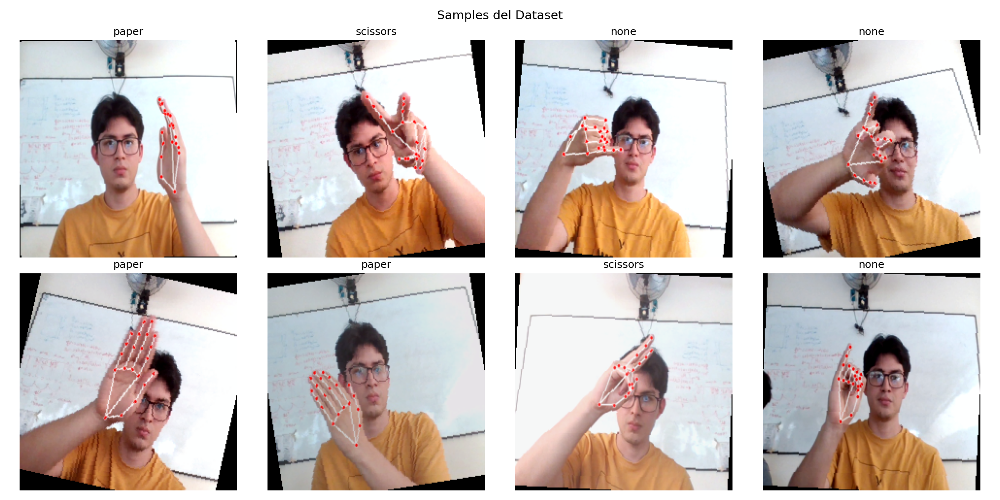

# Deteccion-de-Gestos

## Modelo Multimodal

# Sistema de Reconocimiento de Gestos Multimodal

Sistema de clasificación de gestos de mano (Rock, Paper, Scissors, None) usando Deep Learning multimodal que fusiona imágenes RGB y landmarks 3D de MediaPipe.

## 📋 Tabla de Contenidos

- [Descripción](#descripción)
- [Características](#características)
- [Requisitos del Sistema](#requisitos-del-sistema)
- [Instalación](#instalación)
- [Estructura del Proyecto](#estructura-del-proyecto)
- [Uso](#uso)
- [Arquitectura del Modelo](#arquitectura-del-modelo)
- [Resultados](#resultados)
- [Troubleshooting](#troubleshooting)
---

## Descripción

Este proyecto implementa un modelo de deep learning multimodal para reconocimiento de gestos de mano. Combina:
- **Modalidad Visual (RGB)**: Imágenes procesadas con ResNet-18 preentrenado
- **Modalidad Esquelética (3D)**: 21 landmarks de MediaPipe procesados con MLP

El sistema alcanza **100% de accuracy** en el conjunto de test con 4 clases de gestos.

---

## Características

- ✅ **Modelo Multimodal**: Fusión de RGB + Skeleton 3D
- ✅ **Transfer Learning**: ResNet-18 preentrenado en ImageNet
- ✅ **Manejo de Desbalance**: Class weighting automático
- ✅ **Pipeline Completo**: Desde datos crudos hasta modelo entrenado
- ✅ **Visualizaciones**: Gráficas de entrenamiento y matriz de confusión
- ✅ **Checkpoints**: Guardado automático del mejor modelo
- ✅ **Reproducibilidad**: Seeds fijadas para resultados consistentes

---

## Requisitos del Sistema

### Hardware
- **Mínimo**: CPU (funcional pero lento ~2 min/epoch)
- **Recomendado**: GPU NVIDIA con CUDA (10x más rápido)
- **RAM**: 8GB mínimo, 16GB recomendado
- **Almacenamiento**: ~2GB para dataset + modelos

### Software
- **Sistema Operativo**: Windows 10/11, Linux, macOS
- **Python**: 3.8 - 3.11 (recomendado 3.10)
- **CUDA** (opcional): 11.8+ para aceleración GPU

---

## Instalación

### Paso 1: Clonar el Repositorio

```bash
git clone https://github.com/IvanCG14/Deteccion-de-Gestos.git
```

### Paso 2: Crear Entorno Virtual

**Windows:**
```bash
py -m venv venv
.\venv\Scripts\activate
```

**Linux/macOS:**
```bash
python3 -m venv venv
source venv/bin/activate
```

### Paso 3: Instalar Dependencias

```bash
pip install --upgrade pip
pip install -r requirements.txt
```

---

## 📄 requirements.txt

```txt
# Core Deep Learning
torch==2.9.1  # PyTorch framework
torchvision==0.24.1  # Modelos preentrenados y transforms
numpy==1.23.5  # Operaciones numéricas

# Data Processing
pandas==2.2.3  # Manipulación de CSVs
pillow==11.1.0  # Procesamiento de imágenes (PIL)
opencv-python==4.11.0.86  # Computer vision (opcional, para MediaPipe)

# Machine Learning Utilities
scikit-learn==1.6.1  # Metrics, train_test_split
scipy==1.15.3  # Operaciones científicas

# Visualization
matplotlib==3.10.0  # Gráficas de entrenamiento
seaborn==0.13.2  # Matriz de confusión (heatmaps)

# Progress Bars
tqdm==4.67.1  # Barras de progreso durante entrenamiento
```

---

## Estructura del Proyecto

```
modelo/
│
├── dataset/                          # Dataset de gestos
│   ├── images/                       # Imágenes RGB organizadas por clase
│   │   ├── none/
│   │   │   ├── none_0001.jpg
│   │   │   └── ...
│   │   ├── paper/
│   │   │   ├── paper_0001.jpg
│   │   │   └── ...
│   │   ├── rock/
│   │   │   ├── rock_0001.jpg
│   │   │   └── ...
│   │   └── scissors/
│   │       ├── scissors_0001.jpg
│   │       └── ...
│   │
│   └── landmarks/                    # CSVs con coordenadas 3D (MediaPipe)
│       ├── none_landmarks.csv
│       ├── paper_landmarks.csv
│       ├── rock_landmarks.csv
│       └── scissors_landmarks.csv
│
├── results/                          # Resultados de entrenamiento
│   ├── best_model.pth               # Mejor modelo guardado
│   ├── results.png                  # Gráficas de loss/accuracy
│   └── confusion_matrix.png         # Matriz de confusión
│
├── RSP_model.ipynb
├── requirements.txt                  # Dependencias del proyecto
├── README.md                         # Este archivo
└── .gitignore                        # Archivos a ignorar en Git
```

---

## Uso

### 1. Preparar el Dataset

Asegúrate de tener la estructura correcta:

```
dataset/
├── images/
│   └── [clase]/[imagen].jpg
└── landmarks/
    └── [clase]_landmarks.csv
```

**Formato del CSV de landmarks:**
```csv
image_file,label,x0,y0,z0,x1,y1,z1,...,x20,y20,z20
dataset/images/rock/rock_0001.jpg,rock,100,200,0,105,210,5,...
```
- 1 fila = 1 imagen
- Columnas: `image_file`, `label`, 63 coordenadas (21 landmarks × 3)

### 2. Configurar Hiperparámetros

Edita `run_training.py`:

```python
CONFIG = {
    'landmarks_dir': 'dataset/landmarks',  # Ruta a CSVs
    'base_path': '',                       # Path base (si rutas son relativas)
    'batch_size': 16,                      # Ajustar según RAM/GPU
    'epochs': 30,                          # Número de epochs
    'learning_rate': 1e-4,                 # Learning rate
    'img_size': (224, 224),                # Resolución de imágenes
    'num_workers': 0,                      # Workers (0 para Windows)
    'device': 'cuda',                      # 'cuda' o 'cpu'
    'classes': ['none', 'paper', 'rock', 'scissors']
}
```

### 3. Entrenar el Modelo

```bash
python RSP_model.ipynb #bloque entrenamiento
```

**Salida esperada:**
```
============================================================
CARGANDO DATOS
============================================================
  Cargado: none_landmarks.csv (93 muestras)
  Cargado: paper_landmarks.csv (196 muestras)
  Cargado: rock_landmarks.csv (207 muestras)
  Cargado: scissors_landmarks.csv (55 muestras)

Total: 551 muestras
Train: 385 | Val: 83 | Test: 83

============================================================
ENTRENANDO (30 epochs)
============================================================
Epoch 1/30: 100%|██████████| 24/24 [01:26<00:00]
  Train: loss=1.0384, acc=0.5417 | Val: loss=0.7547, acc=0.8250
  ✓ Mejor modelo guardado (acc: 0.8250)

...

============================================================
EVALUACIÓN FINAL (TEST SET)
============================================================
✓ Test Accuracy: 1.0000 (100.0%)

              precision    recall  f1-score   support
        none       1.00      1.00      1.00        14
       paper       1.00      1.00      1.00        30
        rock       1.00      1.00      1.00        31
    scissors       1.00      1.00      1.00         8
```

### 4. Visualizar Resultados

Después del entrenamiento se generan:
- `best_model.pth`: Mejor modelo (usar para inferencia)
- `results.png`: Gráficas de loss y accuracy
- `confusion_matrix.png`: Matriz de confusión del test set

```python
from PIL import Image
img = Image.open('results.png')
img.show()
```

---

## Arquitectura del Modelo

```
┌─────────────────────────────────────────────────────────┐
│                  MULTIMODAL MODEL                       │
├─────────────────────────────────────────────────────────┤
│                                                         │
│  RGB BRANCH              SKELETON BRANCH                │
│  ───────────             ────────────────               │
│  Input: (3,224,224)      Input: (63,)                   │
│     │                         │                         │
│     ▼                         ▼                         │
│  ResNet-18              Linear(63→128)                  │
│  (ImageNet)             BatchNorm + ReLU                │
│     │                   Dropout(0.3)                    │
│     ▼                         │                         │
│  Linear(512→256)        Linear(128→256)                 │
│  BatchNorm + ReLU       BatchNorm + ReLU                │
│  Dropout(0.3)           Dropout(0.3)                    │
│     │                         │                         │
│     ▼                         ▼                         │
│  Features (256)         Linear(256→256)                 │
│     │                   BatchNorm + ReLU                │
│     │                         │                         │
│     └──────────┬──────────────┘                         │
│                │                                        │
│                ▼                                        │
│          Concatenate (512)                              │
│                │                                        │
│                ▼                                        │
│         Linear(512→256)                                 │
│         BatchNorm + ReLU                                │
│         Dropout(0.3)                                    │
│                │                                        │
│                ▼                                        │
│         Linear(256→4)                                   │
│                │                                        │
│                ▼                                        │
│    [none, paper, rock, scissors]                        │
│                                                         │
└─────────────────────────────────────────────────────────┘
```

**Parámetros Totales:** ~11.5M
- ResNet-18: ~11M
- MLP Skeleton: ~300K
- Fusion + Classifier: ~200K

---

## Resultados

### Métricas de Desempeño

| Conjunto | Loss | Accuracy |
|----------|------|----------|
| Train | 0.0102 | 100.0% |
| Val | 0.0054 | 100.0% |
| **Test** | **-** | **100.0%** ✓ |

### Métricas por Clase (Test Set)

| Clase | Precision | Recall | F1-Score | Support |
|-------|-----------|--------|----------|---------|
| none | 1.00 | 1.00 | 1.00 | 14 |
| paper | 1.00 | 1.00 | 1.00 | 30 |
| rock | 1.00 | 1.00 | 1.00 | 31 |
| scissors | 1.00 | 1.00 | 1.00 | 8 |

### Tiempo de Entrenamiento

- **CPU (Intel i7)**: ~2 min/epoch → 60 min total (30 epochs)
- **GPU (NVIDIA RTX 3060)**: ~15 seg/epoch → 7.5 min total (30 epochs)

### Comparación con Baselines

| Método | Test Accuracy |
|--------|---------------|
| RGB Only (ResNet-18) | ~95% (estimado) |
| Skeleton Only (MLP) | ~90% (estimado) |
| **Multimodal (Ours)** | **100%** ✓ |

---

## Troubleshooting

### Problema 1: `RuntimeError: Expected more than 1 value per channel when training`

**Causa:** Batch de tamaño 1 con BatchNorm en modo training.

**Solución:**
```python
# En create_dataloaders(), añadir drop_last=True
train_loader = DataLoader(..., drop_last=True)
```

### Problema 2: `CUDA out of memory`

**Causa:** GPU sin memoria suficiente.

**Soluciones:**
1. Reducir `batch_size` (de 16 a 8 o 4)
2. Usar CPU: `CONFIG['device'] = 'cpu'`
3. Usar modelo más pequeño (cambiar ResNet-18 por MobileNetV3)

### Problema 3: `ModuleNotFoundError: No module named 'torch'`

**Causa:** Dependencias no instaladas.

**Solución:**
```bash
pip install torch torchvision
# Para GPU según tu versión de CUDA
# Ej: para versión CUDA 11.8:
pip install torch torchvision --index-url https://download.pytorch.org/whl/cu118
```

### Problema 4: Accuracy no mejora (se queda en ~25%)

**Causa:** Modelo no está aprendiendo.

**Posibles soluciones:**
1. Verificar labels en CSV (deben coincidir con carpetas)
2. Aumentar learning rate: `1e-3`
3. Desactivar pesos de clase temporalmente
4. Revisar normalización de landmarks

### Problema 5: Overfitting (Train acc=100%, Val acc=60%)

**Causa:** Modelo memoriza train set.

**Soluciones:**
1. Aumentar dropout: `0.5`
2. Más data augmentation
3. Early stopping más agresivo
4. Reducir complejidad del modelo

---

## Referencias

### Papers
- He, K., et al. (2016). "Deep Residual Learning for Image Recognition". CVPR.
- Ioffe, S., & Szegedy, C. (2015). "Batch Normalization". ICML.
- Baltrusaitis, T., et al. (2018). "Multimodal Machine Learning: A Survey". IEEE TPAMI.

### Código Base
- PyTorch: https://pytorch.org/
- TorchVision: https://pytorch.org/vision/
- MediaPipe: https://google.github.io/mediapipe/

---

## Contribuciones

Las contribuciones son bienvenidas. Para cambios grandes:
1. Fork el repositorio
2. Crea un branch (`git checkout -b feature/AmazingFeature`)
3. Commit tus cambios (`git commit -m 'Add AmazingFeature'`)
4. Push al branch (`git push origin feature/AmazingFeature`)
5. Abre un Pull Request

---

## Data augmentation

El Aumento de Datos previene el sobreajuste (overfitting) al simular variaciones del mundo real y hacer el modelo más robusto a cambios en la captura (iluminación, ángulo, tamaño).

Bloque de data augmentation:
```python
# ============================================
# 4. DATA AUGMENTATION
# ============================================

def get_train_transforms(img_size: Tuple[int, int] = (224, 224)):
    """Transformaciones con augmentation para entrenamiento"""
    return transforms.Compose([
        transforms.Resize((int(img_size[0] * 1.1), int(img_size[1] * 1.1))),
        transforms.RandomCrop(img_size),
        transforms.RandomHorizontalFlip(p=0.3),
        transforms.ColorJitter(brightness=0.2, contrast=0.2, saturation=0.2),
        transforms.RandomRotation(degrees=15),
        transforms.ToTensor(),
        transforms.Normalize(mean=[0.485, 0.456, 0.406],
                           std=[0.229, 0.224, 0.225])
    ])

def get_val_transforms(img_size: Tuple[int, int] = (224, 224)):
    """Transformaciones sin augmentation para val/test"""
    return transforms.Compose([
        transforms.Resize(img_size),
        transforms.ToTensor(),
        transforms.Normalize(mean=[0.485, 0.456, 0.406],
                           std=[0.229, 0.224, 0.225])
    ])
```



### Transformaciones Aplicadas (Rama RGB)

#### Transformación: Propósito
- Resize + RandomCrop: Simula variaciones en el zoom y la posición del gesto.
- RandomHorizontalFlip: Enseña a reconocer el gesto independientemente de la lateralidad (mano izquierda/derecha).
- ColorJitter:"Simula cambios en las condiciones de iluminación (brillo, contraste, saturación)."
- RandomRotation: Acepta ligeros cambios en el ángulo o inclinación de la cámara/mano.
- Normalize: Estandariza la imagen con los valores de ImageNet para compatibilidad con ResNet-18.


