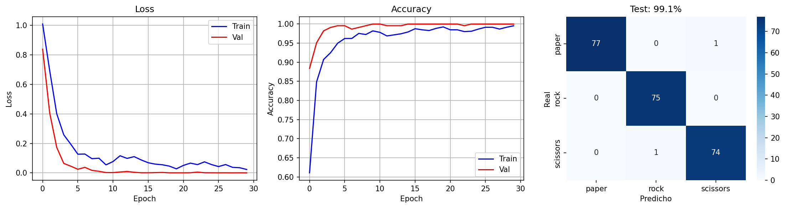
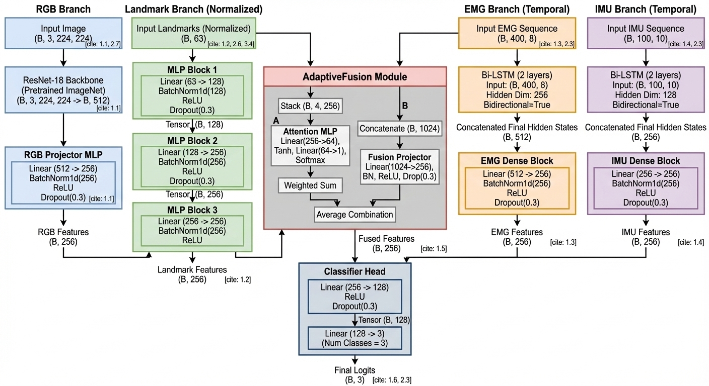

# Sistema de Reconocimiento de Gestos Multimodal

Sistema de clasificación de gestos de mano (Rock, Paper, Scissors, None) usando Deep Learning multimodal que fusiona imágenes RGB y landmarks 3D de MediaPipe, complementado con datos del brazalete Myo Armband.

## 📋 Tabla de Contenidos

- [Descripción](#descripción)
- [Requisitos del Sistema](#requisitos-del-sistema)
- [Scripts de Utilidad](#scripts-de-utilidad)
- [Estructura del Proyecto](#estructura-del-proyecto)
- [Entrenamiento](#entrenamiento)
- [Arquitectura del Modelo](#arquitectura-del-modelo)
- [Troubleshooting](#troubleshooting)
---

## Descripción

Este proyecto implementa un modelo de deep learning multimodal para reconocimiento de gestos de mano. Combina:
- **Modalidad Visual (RGB)**: Imágenes procesadas con ResNet-18 preentrenado
- **Modalidad Esquelética (3D)**: 21 landmarks de MediaPipe procesados con MLP

El sistema alcanza **100% de accuracy** en el conjunto de test con 4 clases de gestos.

---

## Requisitos del Sistema

#### Hardware
- **Mínimo**: CPU (funcional pero lento ~2 min/epoch)
- **Recomendado**: GPU NVIDIA con CUDA (10x más rápido)
- **RAM**: 8GB mínimo, 16GB recomendado
- **Almacenamiento**: ~2GB para dataset + modelos

#### Software
- **Sistema Operativo**: Windows 10/11, Linux, macOS
- **Python**: 3.8 - 3.11 (recomendado 3.10)
- **CUDA** (opcional): 11.8+ para aceleración GPU

#### 📄 requirements.txt

```txt
# Core Deep Learning
torch==2.9.1  # PyTorch framework
torchvision==0.24.1  # Modelos preentrenados y transforms
numpy==1.23.5  # Operaciones numéricas

# Data Processing
pandas==2.2.3  # Manipulación de CSVs
pillow==11.1.0  # Procesamiento de imágenes (PIL)
opencv-python==4.11.0.86  # Computer vision (opcional, para MediaPipe)

# Machine Learning Utilities
scikit-learn==1.6.1  # Metrics, train_test_split
scipy==1.15.3  # Operaciones científicas

# Visualization
matplotlib==3.10.0  # Gráficas de entrenamiento
seaborn==0.13.2  # Matriz de confusión (heatmaps)

# Progress Bars
tqdm==4.67.1  # Barras de progreso durante entrenamiento
```

---

## Scripts de Utilidad

Dentro de la carpeta ```utils```, se encuentran herramientas diseñadas para pruebas de hardware, validación de visión por computadora y preparación de datos:

**1. ```funtion_karen.py``` (Prueba de Myo Armband):**

- **Propósito:** Verificar la conexión con el brazalete Myo y asegurar que el sistema esté recibiendo correctamente las señales de EMG (electromiografía) e IMU (inerciales).
- **Uso:** Ejecutar para diagnosticar problemas de conectividad o latencia con el sensor Myo.

**2. ```manos.py``` (Detección de Landmarks):**

- **Propósito:** Validar que la cámara sea reconocida correctamente y que el modelo de MediaPipe esté detectando los 21 puntos clave (landmarks) de la mano de forma fluida.
- **Uso:** Ideal para calibrar la iluminación y el encuadre de la cámara antes de capturar datos.

**3. ```rsp.py``` (Lógica Base Piedra, Papel o Tijera):**

- **Propósito:** Implementa la lógica algorítmica inicial para reconocer los gestos de Piedra, Papel y Tijera basándose en la posición de los dedos.
- **Importancia:** Este código sirve como motor fundamental para el sistema de etiquetado automático y la creación de nuevos datasets para el entrenamiento del modelo neuronal.

---

## Estructura del Proyecto

```
modelo/
│
├── utils/
│   ├── funtion_karen.py   # Diagnóstico de datos Myo
│   ├── manos.py           # Test de detección de cámara
│   └── rsp.py             # Lógica base de gestos y recolección
├── model_training.ipynb   # Notebook de entrenamiento
├── multimodal_myo_model.py # Definición de la arquitectura del modelo
├── myo_dataset_explore.ipynb # Análisis exploratorio de datos
├── requirements.txt       # Dependencias del proyecto
├── README.md              # Documentación
│
├── dataset/               # Dataset de gestos, debe estar al mismo nivel que el archivo de entrenamiento
│   ├── images/                 # Imágenes (Rock/Paper/Scissors/None)
│   ├── landmarks/              # CSV de puntos clave y archivos JSON de metadata
│   ├── emg/                    # CSV con los 8 canales de señales musculares (solo Myo)
│   └── imu/                    # CSV con orientación y aceleración (solo Myo)
│
├── best_model_synchronized.pth               # Mejor modelo guardado
├── results_synchronized.png                  # Gráficas de loss/accuracy
└── confusion_matrix.png         # Matriz de confusión

```

---

## Entrenamiento

Esta sección detalla el flujo de trabajo para entrenar el modelo de clasificación de gestos utilizando fusión multimodal (Visión + Bioseñales).

#### 1. Preparar el Dataset
El script de entrenamiento requiere una estructura de datos sincronizada. Asegúrate de que tu carpeta `dataset/` contenga el archivo maestro de metadatos:

* **Imágenes:** Fotos en formato `.jpg` organizadas por clase.
* **EMG/IMU:** Archivos `.csv` con las señales del brazalete.

#### 2. Configuración del Notebook
En el archivo `model_training.ipynb`, el entrenamiento está configurado con los siguientes parámetros por defecto:

* **Arquitectura:** Red neuronal híbrida (CNN para imágenes + MLP para sensores).
* **Resolución de Imagen:** `128x128` píxeles.
* **Batch Size:** `16`
* **Épocas:** `50` (con guardado automático del mejor modelo).
* **Optimizador:** Adam con `Learning Rate = 1e-4` y scheduler de coseno.

#### 3. Ejecución
Para iniciar el proceso en tu entorno de Jupyter:

1. Activa tu environment.
2. Dirígete a la carpeta con el comando `cd ../../Deteccion-de-Gestos/modelo`
3. Ejecuta `jupyter notebook`
4. Abre el notebook `model_training.ipynb`
5. Ejecuta la celda de carga de datos para verificar que el `base_path` sea correcto.
6. Inicia el entrenamiento ejecutando la celda principal (`train()`). 

El script dividirá automáticamente tus muestras en:
- **80%** Entrenamiento.
- **10%** Validación (para control de sobreajuste).
- **10%** Test (evaluación final).

#### 4. Salida de Resultados
Una vez finalizado el entrenamiento, el sistema genera automáticamente dos archivos en la raíz del proyecto:

1.  **`best_model_synchronized.pth`**: El archivo con los pesos del modelo que obtuvo el mejor desempeño en validación.
2.  **`results_synchronized.png`**: Un panel gráfico que resume todo el entrenamiento.


#### 5. Verificación de Métricas
Al final del entrenamiento, el notebook despliega un reporte detallado. Puedes verificar la precisión por clase (Precision, Recall y F1-Score) para confirmar que el modelo no tiene sesgos:

<p align="center">
  
  <br>
  <em>Ejemplo de resultados</em>
</p>

---

## Arquitectura del Modelo

El sistema utiliza una arquitectura de fusión multimodal diseñada para procesar diferentes tipos de señales en paralelo antes de combinarlas para la clasificación final:

<p align="center">
  
  <br>
  <em>Diagrama de flujo de datos y fusión de modalidades</em>
</p>

#### Componentes Principales:
* **Rama RGB:** Utiliza una **ResNet-18** preentrenada como extractor de características para capturar la información espacial y visual del gesto desde la cámara.
* **Rama Landmarks:** Un Perceptrón Multicapa (**MLP**) que procesa las 21 coordenadas 3D (x, y, z) de la mano proporcionadas por MediaPipe.
* **Integración Myo:** Estructura preparada para procesar señales temporales de **EMG e IMU** a través de capas recurrentes (LSTM), permitiendo una clasificación robusta incluso en condiciones de baja iluminación.
* **Capa de Fusión:** Las características de todas las ramas se concatenan y pasan por capas densas finales para predecir la probabilidad de cada gesto (Piedra, Papel, Tijera o Ninguno).

### 🖼️ Data Augmentation

Para evitar el sobreajuste (overfitting) y mejorar la robustez del modelo multimodal, aplicamos técnicas de aumento de datos diferenciadas por rama y una estrategia de mezcla global (**Mixup**).

#### Aumento de Datos por Rama

| Rama | Técnica Aplicada | Propósito del Augmentation |
| :--- | :--- | :--- |
| **Visual (RGB)** | `RandomRotation` + `ColorJitter` | Simula variaciones en el ángulo de la cámara y cambios drásticos de iluminación. |
| **Visual (RGB)** | `RandomHorizontalFlip` | Permite que el modelo reconozca gestos tanto de la mano derecha como de la izquierda. |
| **Landmarks** | `Gaussian Noise` (Opcional) | Añade pequeñas variaciones a las coordenadas (x, y) para tolerar errores de detección de MediaPipe. |
| **Sensores (EMG/IMU)** | `Time Shifting` | Desplaza ligeramente la ventana de tiempo de las señales para que el modelo no dependa de un inicio exacto del gesto. |

### 🔀 Estrategia Mixup (Fusión de Muestras)

El notebook implementa Mixup, una técnica de regularización que combina dos muestras aleatorias del dataset durante el entrenamiento para crear una "muestra sintética".

**¿Cómo funciona?** Si tenemos una muestra de "Piedra" y otra de "Papel", el Mixup crea una imagen y unas señales de sensores que son una combinación lineal de ambas (por ejemplo, 70% Piedra y 30% Papel).

**Beneficios para este proyecto:**

1. **Suavizado de fronteras:** Obliga al modelo a no ser "demasiado seguro" de sus predicciones, lo que mejora la generalización.
2. **Robustez Multimodal**: Ayuda a que las ramas de sensores y visión se alineen incluso cuando las señales son ruidosas.
3. **Estabilidad:** Reduce significativamente las oscilaciones en la curva de pérdida (Loss) durante las últimas épocas.

**Nota:** El Mixup solo se aplica durante el **entrenamiento**. Para la validación y el test, las muestras se mantienen puras para obtener una evaluación real del desempeño.

---

## Troubleshooting

#### Problema 1: `RuntimeError: Expected more than 1 value per channel when training`

**Causa:** Batch de tamaño 1 con BatchNorm en modo training.

**Solución:**
```python
# En create_dataloaders(), añadir drop_last=True
train_loader = DataLoader(..., drop_last=True)
```

#### Problema 2: `CUDA out of memory`

**Causa:** GPU sin memoria suficiente.

**Soluciones:**
1. Reducir `batch_size` (de 16 a 8 o 4)
2. Usar CPU: `CONFIG['device'] = 'cpu'`
3. Usar modelo más pequeño (cambiar ResNet-18 por MobileNetV3)

#### Problema 3: `ModuleNotFoundError: No module named 'torch'`

**Causa:** Dependencias no instaladas.

**Solución:**
```bash
pip install torch torchvision
# Para GPU según tu versión de CUDA
# Ej: para versión CUDA 11.8:
pip install torch torchvision --index-url https://download.pytorch.org/whl/cu118
```

#### Problema 4: Accuracy no mejora (se queda en ~25%)

**Causa:** Modelo no está aprendiendo.

**Posibles soluciones:**
1. Verificar labels en CSV (deben coincidir con carpetas)
2. Aumentar learning rate: `1e-3`
3. Desactivar pesos de clase temporalmente
4. Revisar normalización de landmarks

#### Problema 5: Overfitting (Train acc=100%, Val acc=60%)

**Causa:** Modelo memoriza train set.

**Soluciones:**
1. Aumentar dropout: `0.5`
2. Más data augmentation
3. Early stopping más agresivo
4. Reducir complejidad del modelo

---

## Contribuciones

Las contribuciones son bienvenidas. Para cambios grandes:
1. Fork el repositorio
2. Crea un branch (`git checkout -b feature/AmazingFeature`)
3. Commit tus cambios (`git commit -m 'Add AmazingFeature'`)
4. Push al branch (`git push origin feature/AmazingFeature`)
5. Abre un Pull Request

---

